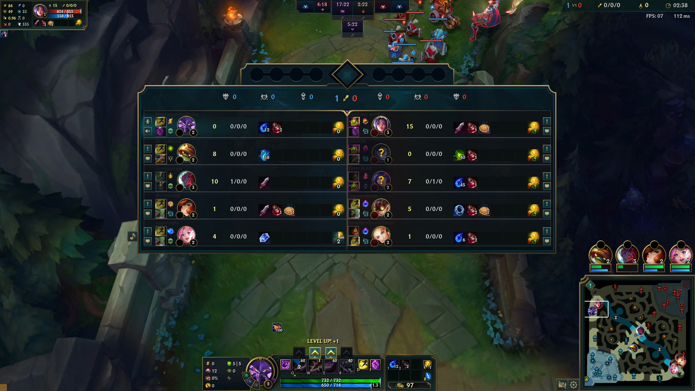
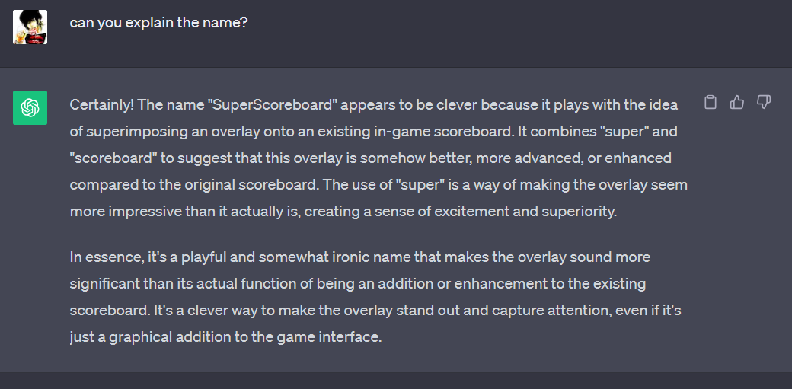

# SuperScoreboard

SuperScoreboard is an overlay for League of Legends to track cooldowns. (Proof of concept.)

Our overlay is **superimposed** onto the in-game **scoreboard**, hence the name.

What's "super" about it is how easy and intuitive it is to use: \
It codifies(?) common practices, like double clicking an enemy summ to signal that it was used. \
Also, it uses familiar UI patterns, like holding a button to reset or toggle its state (e.g. holding the Mute Player button to mute/unmute someone).

## Design

**How it should work**:

- Pressing tab (maybe only when the game is running ~~and is fullscreen~~):
    * Display a semi-transparent SuperScoreboard overlay in the center of the screen, covering the in-game scoreboard.

- Double clicking a summ:
    * Sets (or resets) its timer.
    * Also results in pinging it in-game.

- Long pressing a summ:
    * Unsets its cooldown.
    * Shows a loading indicator, similar to the "Mute Player Comms" effect.

- ~~Right clicking a participnt~~:
    * Change its position (swapping positions).

- ~~Double clicking the app's icon~~
    * It should copy Flash timers to the clipboard or type it in team chat.

**Timer formats**:
- "`~SSS`" or "`~MM:SS`" When the summ will be up (in-game time).
- "`=SSS`" The summ's calculated cooldown at the moment of recording.
- "`<SSS`" How many seconds are left.

**Goals**:

- Simplistic, no-nonsense.

- Takes runes and items into account.
    * If any opponent has the Inspiration rune, try to fetch all minor runes (from external APIs).
    * If that fails, just fallback to assuming that **if a player has Inspiration tree, they also have Cosmic Insight** ("Insp = Cosmic").

- Takes delay into account
(the player is not going to instantly record the usage of a summ, so we should that it was used a few seconds earlier, say 5 secs).
- Reflects the ordering of participants on the ingame scoreboard.
    + Preferably automatically reflects the ingame scoreboard order.
    + ~~Otherwise, we can always let the user manually reorder SuperScoreboard's participants using a context menu (e.g. "Move to TOP").~~

- Should be lighter than existing solutions.
(Use something like C#/WPF or Java/Swing, no Chromium bullshit.
I just needed something that works on my hunk of metal :/)

**Non-goals**:

- Automatically tracking summs (e.g. if we "see" them being used, using some AI/CV/sound recognition bullshit or even process memory reading... Too complex. Too hacky/scripty.).

- Reading "Team Chat" and trusting teammates' pings. \
(AFAIK, you can't access in-game chat using client APIs (LCU or LiveClientData), but you can still use AI/OCR. Again, fuck AI bullshit.) \
(And, yes, I am aware that you can access chat using unofficial libraries/SDKs, like [Overwolf](https://overwolf.github.io/api/games/events/league-of-legends#chat))

## Getting Started

**Prerequisites**:
- Windows 10. \
(Anything newer than Windows XP should work)

Just download the portable binary from **Releases** and run it.

Run the overlay and League (in either order) and it should work.

The game must run in Borderless mode.

## Uses

External dependencies:

- [Google's gson](https://github.com/google/gson)
    * "A Java serialization/deserialization library to convert Java Objects into JSON and back"

- [R4J](https://github.com/stelar7/R4J)
    * "A Java library containing the API for every Riot game"
    * It has support for LCU and contains POJOs for LiveGame Data.
    * We use it mostly to get authorization headers and make raw ("custom") requests that we later parse using gson.

- [ ] https://github.com/stirante/lol-client-java-api
    * It seems better than R4J.

## Expected Questions

### What cooldowns can we track?
For now, only summs, but ult and item cooldowns are no different.\
Item CDs are easy to implement.\
However, ult CDs are more complex because they rely on multiple variables:
- Using **Ultimate Hunter** and having some stacks.
- Using **Transcendence**. It gives +5 AH at lvl 5 and again at lvl 8. (while we get and may use our ult at lvl 6)
- Having **Axiom Arc** and getting some takedowns while the ult is on CD.
- **Staff of Flowing Water**'s passive.
    * For example, Sona R normally is 133 seconds,
      but becomes 112 secs after shileding someone and gaining +20 AH from Staff.
- Some R cds get refreshed partially when some conditions are met:
    * Katarina on takedowns.
    * Sona after maxing her passive.
    * Ezreal after hitting anything with his Q.

### How is it different from others?

- All of them display their overlays next to the scoreboard (juxtaposed), while ours is superimposed onto the scoreboard.

- If the player want to track the summ *and* ping it, they have to click in two different places.
Our project (or at least its goal) allows you to click only in once place.

- Most of the open source projects either require a Riot API key, disregard runes, or simply assume that "insp = cosmic".
Our project does not. It just works.

## Existing projects

**Closed source**:

- Overwolf-based: Mobalytics, Porofessor, U.GG, etc.

- Other: OP.GG

**Open source**:

- SummonerTracker Overlay (https://github.com/CodeIsJustLikeMagic/SummonerTrackerOverlay)
    * "An Overlay intended for Tracking Summoner Spells and sharing them with teammates."
    * Written in Python, uses PyQt5 and MQTT (to share info between teammates).
    * **Feature**
        + :purple_square: The summoner spell buttons will assume that the spell has been used 7 seconds ago.
        + :green_square: Only uses Client features (no dependency on external Riot APIs).
        + :green_square: Tracks ult CD based on its initial cooldown + AH from dragons (Cloud) + AH from items.
        + :red_square: "The overlay is not visible if you play in fullscreen mode."
        + :purple_square: "reload" will update the positions of the Champions in the Setter Window according to the in game scoreboard.
    * It assumes that Insp = Cosmic Insight.

- Pocket DoinB (https://github.com/daiy29/DoinB)
    * Written in Python, uses Tkinter and RiotWatcher,
      and depends on Riot APIs (Summoner and Spectator).

- LoLSSTracker (https://github.com/cody-k/LoLSSTracker)
    * "A non-overlay League of Legends summoner spell tracker built in C#."
    * Written in C#, uses WinForms,
      and depends on Riot APIs.

## Name

- **Superimposed Scoreboard**
    * Other overlays are "juxtaposed". Ours is "superimposed" onto the ingame scoreboard.

- **Super Scoreboard**
Short version of the previous name.

- **Omnistone Superset**
Not only the scoreboard, it may also include Seer Stone (minimap) and Beeper (QuinnAD mentioned it).

ChatGPT gets it:

<blockquote id="chatgpt-response" hidden>
    The name "SuperScoreboard" appears to be clever because it plays with the idea of superimposing an overlay onto an existing in-game scoreboard. It combines "super" and "scoreboard" to suggest that this overlay is somehow better, more advanced, or enhanced compared to the original scoreboard. The use of "super" is a way of making the overlay seem more impressive than it actually is, creating a sense of excitement and superiority.

    In essence, it's a playful and somewhat ironic name that makes the overlay sound more significant than its actual function of being an addition or enhancement to the existing scoreboard. It's a clever way to make the overlay stand out and capture attention, even if it's just a graphical addition to the game interface.
</blockquote>

## Terms

- **Participant**: A player in a game, identified by their summoner name.
- **Principal** Participant: The current user, the current player, the active player (as `LiveClientData` calls them).

- **League Client** (CEF-based).
- **Game Client** (DirectX9-based).
- **Riot Client**.

## Colored squares

GitHub-supported emoji.

- :green_square: Green: Good.
- :red_square: Red: Bad.
- :yellow_square: Yellow: Warning or "sus".
- :purple_square: Purple: Just something worth noting.

## Disclaimer

This is a free fan project.

It has not been verified/approved by Riot, and it may violate the game's  terms of service. **Use at your own risk.** \
(Maybe checK [Riot Games's Legal page](https://www.riotgames.com/en/legal))

**_SuperScoreboard_ is not endorsed, certified or otherwise approved in any way by Riot Games, Inc. or any of its affiliates.**

## License

WTFPL
