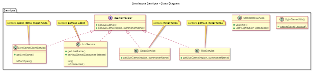

# Understanding



## Getting minor runes

We can only get major runes from the LCU.

As for minor runes, we need to get them from external sources:

- [ ] `RiotService`:
    * [SPECTATOR-V4 API](https://developer.riotgames.com/apis#spectator-v4/GET_getCurrentGameInfoBySummoner)
    * Requires an API key though.

- [x] `OpggService`
    * OPGG exposes their internal REST API, so... eh.

- [ ] `MobalyticsService`:
    * Apparently they have an ~~unprotected~~ public GraphQL endpoint.
    * KAITO: Better than OPGG's shit.


## In-game UI

The League UI is not consistent.

Timers ("progress indicators") kind of tick in two different directions:
- Showing remaining time: Abilities on the HUD, Summoner Spells on the HUD and Scoreboard, champion buffs/debuffs (e.g. Taste of Blood, First Strike).
- Showing elapsed time: Ultimate cooldowns above teammates' portraits.


## LiveClientData

- We can get the **Principal**'s summoner name (but not region) from **LiveClientData**.
```java
/* partial */ class LiveClientDataService {
    public List<String> getPrincipal() {
        return getPrincipal4();
    }

    private List<String> getPrincipal4() {
        // ...
        // `activePlayer.summonerName` is `null` in replays.
        // This is the current behavior anyways.
        String summonerName = session.activePlayer.summonerName;
        String region = null;
        return List.of(region, summonerName);
    }
}
```

- While the game client is still in the loading screen,
`https://127.0.0.1:2999/liveclientdata/allgamedata`
returns
```json
{
    "errorCode": "RESOURCE_NOT_FOUND",
    "httpStatus": 404,
    "message": "Invalid URI format"
}
```

### Players order

- Apparently, the `/playerlist` (or the `allPlayers` field in `/allgamedata`)
sorts participants based on their scoreboard position. \
If the user reorders them in the Game Client (scoreboard), `/playerlist` will reflect that change.
```java
// LightGame.setParticipantsOrder(List<String>)
```


## DDragon

In `summoner.json`:
- `SummonerSmite`'s cooldown is 15s. This doesn't seem right.
It does not mention the cooldown (or recharge time) of the second charge.
